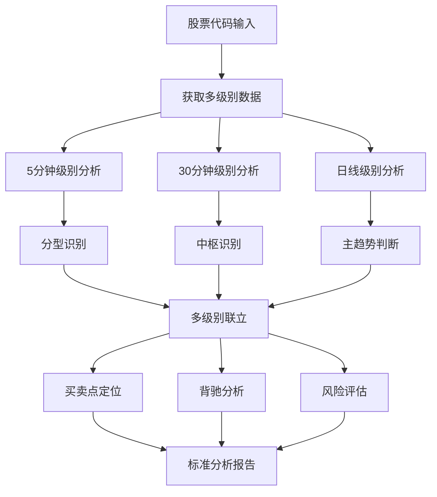

# 🎯 缠论多级别股票分析解决方案

基于缠中说禅理论的专业股票技术分析工具，支持5分钟、30分钟、日线多级别联立分析。

[](https://opensource.org/licenses/Apache-2.0)
[](https://github.com/charliedream1/ai_quant_trade)

## 📋 目录
- [核心理念](#核心理念)
- [标准分析框架](#标准分析框架)
- [快速开始](#快速开始)
- [分析流程](#分析流程)
- [使用方法](#使用方法)
- [代码示例](#代码示例)
- [标准报告格式](#标准报告格式)
- [注意事项](#注意事项)

---

## 🎯 核心理念

### 缠论三大核心
1. **走势分解**：笔 → 线段 → 中枢 → 走势类型
2. **多级别联立**：大级别定方向，小级别找买点
3. **背驰判断**：MACD与价格背离识别买卖点

### 级别关系
- **日线级别**：确定主趋势方向 (大级别)
- **30分钟级别**：识别中枢结构 (中级别)  
- **5分钟级别**：精确买卖时机 (小级别)

### 缠论买卖点定义
- **一买**：下跌趋势中的底背驰买点
- **二买**：中枢震荡区间内的买点
- **三买**：突破中枢上沿的追涨买点
- **一卖**：上涨趋势中的顶背驰卖点

---

## 📐 标准分析框架

### 🎯 多级别分析流程



### 📊 核心分析要素

#### 1. 分型识别
- **顶分型**：中间K线最高价大于等于左右K线最高价
- **底分型**：中间K线最低价小于等于左右K线最低价
- **分型确认**：需要至少3根K线确认

#### 2. 中枢理论
- **中枢定义**：至少三个连续的重叠线段形成的震荡区间
- **中枢级别**：根据构成线段的级别确定中枢级别
- **中枢突破**：价格突破中枢上下沿的意义
- **中枢强度**：(中枢高点-中枢低点)/中枢低点*100

#### 3. 背驰判断
- **同级别背驰**：价格新高/新低但MACD不创新高/新低
- **盘整背驰**：中枢震荡过程中的背驰
- **趋势背驰**：趋势延续过程中的背驰
- **背驰确认**：需要MACD与价格明显背离

#### 4. 多级别联立原则
- **大级别定方向**：日线级别确定主趋势
- **中级别找结构**：30分钟级别识别中枢
- **小级别找时机**：5分钟级别寻找精确买卖点
- **级别共振**：多级别信号一致时可靠性更高

---

## ✨ 功能特性

### 🔍 技术分析功能
- ✅ **多级别K线数据获取**：支持5分钟、30分钟、日线数据
- ✅ **分型自动识别**：智能识别顶分型和底分型
- ✅ **中枢自动识别**：智能识别震荡区间和中枢结构
- ✅ **背驰智能判断**：MACD与价格背离分析
- ✅ **买卖点精确定位**：一买、二买、三买信号识别
- ✅ **多级别联立分析**：大中小级别综合分析

### 📊 分析输出
- 📈 **多级别趋势分析**：各级别趋势状态和强度
- 🎯 **中枢结构分析**：中枢区间和当前位置
- 💡 **操作信号生成**：具体的买卖点建议
- ⚠️ **背驰风险评估**：量化背驰风险分析
- 📋 **标准分析报告**：结构化分析结果
- 🔍 **关键价位标注**：支撑阻力位精确定位

---

## 🚀 快速开始

### 环境准备
```bash
# 1. 激活虚拟环境
source venv_analysis/bin/activate

# 2. 确保依赖已安装
pip install akshare pandas numpy warnings

# 3. 测试数据连接
python -c "import akshare as ak; print('AKShare连接正常')"
```

### 30秒快速分析
```python
# 导入分析模块
from chan_theory_analyzer import ChanTheoryAnalyzer

# 创建分析器
analyzer = ChanTheoryAnalyzer()

# 分析股票（以002927为例）
result = analyzer.multi_level_analysis('002927', '泰永长征')

# 输出标准分析报告
analyzer.print_analysis_report(result)
```

---

## 📊 标准分析报告格式

### 🎯 报告结构标准

#### 1. 报告头部信息
```markdown
# 📊 股票名称(代码)标准缠论分析报告

**分析时间**: YYYY年MM月DD日  
**分析框架**: 基于缠中说禅理论的多级别联立分析  
**当前价格**: XX.XX元 (+/-X.XX%)

## 🎯 核心结论
### 💡 投资建议：[✅ 积极买入 | 🟡 谨慎买入 | 🔴 建议减仓]
- **缠论信号**: [三买确认 | 二买区域 | 一买机会 | 观望等待]
- **风险等级**: [低风险 | 中等风险 | 中高风险 | 较高风险]
- **技术面**: [MACD金叉共振 | 多头排列 | 背驰风险等]
```

#### 2. 实时行情数据
```markdown
## 📊 实时行情数据
- **当前价格**: XX.XX元
- **今日涨跌**: +/-X.XX%
- **成交量**: XXX,XXX手
- **成交额**: X.XX亿元
- **振幅**: X.XX%
- **今日最高**: XX.XX元
- **今日最低**: XX.XX元
```

#### 3. 多级别分析标准格式
```markdown
## 🔍 多级别缠论分析

### 📊 5分钟级别分析
- **当前价格**: XX.XX元
- **趋势状态**: [多头排列 | 空头排列 | 震荡整理]
- **中枢区间**: XX.XX-XX.XX元 [或 未识别]
- **中枢位置**: [中枢上方 | 中枢内部 | 中枢下方]
- **背驰状态**: [同步运行 | 顶背驰 | 底背驰]
- **交易信号**: [三买确认 | 二买区域 | 一买机会 | 等待中枢形成]
- **高低点数**: 高点XX个，低点XX个
- **MACD状态**: [MACD金叉 | MACD死叉] (MACD: X.XXXX)

### 📊 30分钟级别分析
[同上格式]

### 📊 日线级别分析
[同上格式]
```

#### 4. 多级别联立分析
```markdown
## 🔄 多级别联立分析

### 📈 各级别趋势状态
- **5分钟**: [趋势状态] (短期)
- **30分钟**: [趋势状态] (中期)
- **日线**: [趋势状态] (长期)

### 💡 各级别交易信号
- **5分钟**: [交易信号]
- **30分钟**: [交易信号]
- **日线**: [交易信号]

### 📊 各级别MACD状态
- **5分钟**: [MACD状态]
- **30分钟**: [MACD状态]
- **日线**: [MACD状态]
```

#### 5. 核心信号分析
```markdown
## 🎯 缠论核心信号分析

### ✅ [三买 | 二买 | 一买]信号确认
**30分钟级别**:
- 中枢区间: XX.XX-XX.XX元
- 当前价格: XX.XX元 [> | < | 在] XX.XX元 (中枢[上沿 | 下沿])
- 突破幅度: X.X%
- 信号强度: [强 | 中 | 弱]

### 🔍 背驰分析
- **各级别背驰状态**: [同步运行 | 顶背驰 | 底背驰]
- **价格与MACD**: [无明显背离 | 明显背离]
- **风险评估**: [暂无背驰风险 | 存在背驰风险]
- **操作安全性**: [较高 | 中等 | 较低]
```

#### 6. 关键价位分析
```markdown
## 🎯 关键价位分析

### 📈 支撑位分析
1. **[级别]中枢上沿**: XX.XX元 (关键支撑)
2. **[级别]中枢下沿**: XX.XX元 (强支撑)
3. **长期支撑**: XX.XX元 (超强支撑)

### 📉 阻力位分析
1. **短期阻力**: XX.XX元 ([前期高点 | 整数关口])
2. **中期阻力**: XX.XX元
```

#### 7. 操作策略
```markdown
## 💡 缠论操作策略

### 🟢 [三买 | 二买 | 一买]操作要点

#### 买入策略
1. **当前位置**: [具体分析]
2. **加仓时机**: [具体价位和条件]
3. **追涨策略**: [具体条件]

#### 仓位管理
- **建议仓位**: XX-XX% (基于信号强度)
- **分批建仓**: [具体方案]
- **最大仓位**: 不超过总资金的XX%

### 🛡️ 风险控制策略
#### 止损设置
1. **[级别]止损**: XX.XX元 ([中枢上沿 | 中枢下沿])
2. **建议止损**: XX.XX元 (综合考虑)

#### 减仓条件
- [具体条件和价位]
```

#### 8. 后市展望
```markdown
## 🔮 后市展望

### 📈 乐观情形 (概率XX%)
- **触发条件**: [具体条件]
- **目标价位**: XX.XX-XX.XX元
- **时间周期**: X-X周
- **操作策略**: [具体策略]

### 📊 中性情形 (概率XX%)
### 📉 悲观情形 (概率XX%)
```

#### 9. 报告结尾
```markdown
## 📚 总结

[股票名称]当前处于[具体状态]，[技术面分析]。[核心观点总结]。

### 🎯 核心观点
1. **[信号确认]**: [具体分析]
2. **[趋势分析]**: [具体分析]
3. **[技术配合]**: [具体分析]
4. **[风险控制]**: [具体分析]

### 💡 操作建议
- **当前阶段**: [具体建议]
- **仓位建议**: [具体比例]
- **风险控制**: [具体措施]

### 🔍 重点关注
1. **[关注点1]**: [具体说明]
2. **[关注点2]**: [具体说明]

---

**免责声明**: 本分析基于缠中说禅理论和多级别技术分析，仅供参考，不构成投资建议。缠论分析具有一定的主观性，投资者应结合自身情况谨慎决策。投资有风险，入市需谨慎。

---

*报告生成时间: YYYY-MM-DD*  
*分析框架: 缠中说禅多级别联立分析*  
*数据来源: AKShare实时数据*  
*分析级别: 5分钟 + 30分钟 + 日线*
```

---

## 🎯 分析质量标准

### ✅ 必须包含的要素
1. **多级别数据**: 至少包含30分钟和日线级别
2. **中枢识别**: 明确标识中枢区间和当前位置
3. **背驰分析**: MACD与价格背离分析
4. **买卖点定位**: 明确的一买、二买、三买信号
5. **风险评估**: 量化的风险等级和止损位
6. **操作建议**: 具体的仓位和操作策略

### 📊 分析深度要求
1. **技术指标**: MACD、均线系统、分型识别
2. **结构分析**: 中枢结构、笔段划分
3. **级别联立**: 多级别信号一致性分析
4. **时间预期**: 合理的时间周期预测
5. **概率评估**: 不同情形的概率分析

### ⚠️ 风险控制标准
1. **止损设置**: 基于中枢边界的明确止损位
2. **仓位管理**: 根据信号强度的仓位建议
3. **风险提示**: 完整的免责声明和风险提示
4. **操作纪律**: 强调严格执行交易纪律

---

## 💻 代码示例

### 完整分析示例
```python
import akshare as ak
import pandas as pd
import numpy as np
from datetime import datetime, timedelta
import warnings
warnings.filterwarnings('ignore')

class ChanTheoryAnalyzer:
    def __init__(self):
        self.periods = {
            '5': '5分钟',
            '60': '30分钟', 
            'daily': '日线'
        }
    
    def get_stock_data(self, symbol, period='daily', limit=200):
        """获取股票数据"""
        try:
            if period == 'daily':
                df = ak.stock_zh_a_hist(symbol=symbol, period='daily', adjust='qfq')
            else:
                df = ak.stock_zh_a_hist_min_em(symbol=symbol, period=period, adjust='qfq')
            
            return df.tail(limit) if len(df) > limit else df
        except Exception as e:
            print(f"获取数据失败: {e}")
            return None
    
    def calculate_indicators(self, df):
        """计算技术指标"""
        # MACD
        exp1 = df['收盘'].ewm(span=12).mean()
        exp2 = df['收盘'].ewm(span=26).mean()
        df['MACD'] = exp1 - exp2
        df['MACD_signal'] = df['MACD'].ewm(span=9).mean()
        df['MACD_hist'] = df['MACD'] - df['MACD_signal']
        
        # 均线系统
        df['MA5'] = df['收盘'].rolling(window=5).mean()
        df['MA10'] = df['收盘'].rolling(window=10).mean()
        df['MA20'] = df['收盘'].rolling(window=20).mean()
        df['MA60'] = df['收盘'].rolling(window=60).mean()
        
        return df
    
    def identify_pivot_points(self, df, window=5):
        """识别高低点"""
        highs = []
        lows = []
        
        for i in range(window, len(df) - window):
            # 高点识别
            if all(df.iloc[i]['最高'] >= df.iloc[j]['最高'] 
                   for j in range(i-window, i+window+1) if j != i):
                highs.append({
                    'index': i,
                    'price': df.iloc[i]['最高'],
                    'time': df.index[i],
                    'macd': df.iloc[i]['MACD']
                })
            
            # 低点识别
            if all(df.iloc[i]['最低'] <= df.iloc[j]['最低'] 
                   for j in range(i-window, i+window+1) if j != i):
                lows.append({
                    'index': i,
                    'price': df.iloc[i]['最低'],
                    'time': df.index[i],
                    'macd': df.iloc[i]['MACD']
                })
        
        return highs, lows
    
    def analyze_center_structure(self, highs, lows):
        """分析中枢结构"""
        if len(highs) < 2 or len(lows) < 2:
            return None
        
        # 取最近的高低点构建中枢
        recent_highs = [h['price'] for h in highs[-3:]]
        recent_lows = [l['price'] for l in lows[-3:]]
        
        if len(recent_highs) >= 2 and len(recent_lows) >= 2:
            center_high = min(recent_highs)  # 中枢上沿
            center_low = max(recent_lows)    # 中枢下沿
            
            if center_high > center_low:
                return {
                    'center_high': center_high,
                    'center_low': center_low,
                    'center_mid': (center_high + center_low) / 2,
                    'center_height': center_high - center_low
                }
        
        return None
    
    def detect_divergence(self, highs, lows, current_price):
        """检测背驰"""
        divergence_signals = []
        
        # 顶背驰检测
        if len(highs) >= 2:
            last_two_highs = highs[-2:]
            if (last_two_highs[1]['price'] > last_two_highs[0]['price'] and 
                last_two_highs[1]['macd'] < last_two_highs[0]['macd']):
                divergence_signals.append('顶背驰')
        
        # 底背驰检测
        if len(lows) >= 2:
            last_two_lows = lows[-2:]
            if (last_two_lows[1]['price'] < last_two_lows[0]['price'] and 
                last_two_lows[1]['macd'] > last_two_lows[0]['macd']):
                divergence_signals.append('底背驰')
        
        return divergence_signals if divergence_signals else ['同步运行']
    
    def generate_trading_signals(self, center, current_price, divergence, trend):
        """生成交易信号"""
        signals = []
        
        if not center:
            return ['等待中枢形成']
        
        # 判断当前位置
        if current_price > center['center_high']:
            position = '中枢上方'
            if '同步运行' in divergence:
                signals.append('三买确认')
            elif '顶背驰' in divergence:
                signals.append('一卖警告')
        elif current_price < center['center_low']:
            position = '中枢下方'
            if '底背驰' in divergence:
                signals.append('一买机会')
            else:
                signals.append('观望等待')
        else:
            position = '中枢内部'
            signals.append('二买区域')
        
        return signals
    
    def single_level_analysis(self, symbol, period='daily'):
        """单级别分析"""
        # 获取数据
        df = self.get_stock_data(symbol, period)
        if df is None or len(df) < 50:
            return None
        
        # 计算指标
        df = self.calculate_indicators(df)
        
        # 识别高低点
        window = 3 if period == '5' else 5
        highs, lows = self.identify_pivot_points(df, window)
        
        # 分析中枢
        center = self.analyze_center_structure(highs, lows)
        
        # 当前状态
        latest = df.iloc[-1]
        current_price = latest['收盘']
        
        # 趋势判断
        if latest['MA5'] > latest['MA10'] > latest['MA20']:
            trend = '多头排列'
        elif latest['MA5'] < latest['MA10'] < latest['MA20']:
            trend = '空头排列'
        else:
            trend = '震荡整理'
        
        # 背驰检测
        divergence = self.detect_divergence(highs, lows, current_price)
        
        # 交易信号
        signals = self.generate_trading_signals(center, current_price, divergence, trend)
        
        return {
            'period': self.periods.get(period, period),
            'current_price': current_price,
            'trend': trend,
            'center': center,
            'divergence': divergence,
            'signals': signals,
            'highs_count': len(highs),
            'lows_count': len(lows)
        }
    
    def multi_level_analysis(self, symbol, name):
        """多级别联立分析"""
        print(f"=== {name} ({symbol}) 缠论多级别分析 ===\n")
        
        results = {}
        periods = ['5', '60', 'daily']
        
        # 各级别分析
        for period in periods:
            result = self.single_level_analysis(symbol, period)
            if result:
                results[period] = result
                self.print_single_level_result(result)
        
        # 多级别综合分析
        if len(results) >= 2:
            self.multi_level_synthesis(results)
        
        return results
    
    def print_single_level_result(self, result):
        """打印单级别分析结果"""
        print(f"📊 {result['period']}级别分析")
        print("-" * 40)
        print(f"   💰 当前价格: {result['current_price']:.2f}元")
        print(f"   📈 趋势状态: {result['trend']}")
        
        if result['center']:
            center = result['center']
            print(f"   🎯 中枢区间: {center['center_low']:.2f}-{center['center_high']:.2f}元")
            
            # 判断位置
            if result['current_price'] > center['center_high']:
                position = '中枢上方'
            elif result['current_price'] < center['center_low']:
                position = '中枢下方'
            else:
                position = '中枢内部'
            print(f"   📍 中枢位置: {position}")
        else:
            print(f"   🎯 中枢区间: 未识别")
        
        print(f"   ⚠️  背驰状态: {' | '.join(result['divergence'])}")
        print(f"   💡 交易信号: {' | '.join(result['signals'])}")
        print(f"   🔢 高低点数: 高点{result['highs_count']}个, 低点{result['lows_count']}个")
        print()
    
    def multi_level_synthesis(self, results):
        """多级别综合分析"""
        print("🔄 多级别联立分析")
        print("=" * 50)
        
        # 趋势一致性分析
        trends = [r['trend'] for r in results.values()]
        signals = [r['signals'][0] if r['signals'] else '观望' for r in results.values()]
        
        print("📈 各级别趋势状态:")
        for period, result in results.items():
            period_name = self.periods.get(period, period)
            print(f"   • {period_name}: {result['trend']}")
        
        print("\n💡 各级别交易信号:")
        for period, result in results.items():
            period_name = self.periods.get(period, period)
            print(f"   • {period_name}: {' | '.join(result['signals'])}")
        
        # 综合建议
        print("\n🎯 综合操作建议:")
        
        # 多级别共振判断
        bullish_count = sum(1 for t in trends if '多头' in t)
        bearish_count = sum(1 for t in trends if '空头' in t)
        
        buy_signals = sum(1 for s in signals if '买' in s)
        sell_signals = sum(1 for s in signals if '卖' in s)
        
        if bullish_count > bearish_count and buy_signals > 0:
            if '三买' in ' '.join(signals):
                suggestion = "✅ 多级别上涨趋势+三买信号，积极买入"
            elif '二买' in ' '.join(signals):
                suggestion = "🟡 多级别上涨趋势+二买信号，适量买入"
            else:
                suggestion = "🟢 多级别上涨趋势，可考虑买入"
        elif bearish_count > bullish_count or sell_signals > 0:
            suggestion = "🔴 趋势偏弱或有卖出信号，建议观望或减仓"
        else:
            suggestion = "🟡 级别间分歧，建议观望等待明确信号"
        
        print(f"   {suggestion}")
        
        # 关键价位
        centers = []
        for result in results.values():
            if result['center']:
                centers.append(f"{result['center']['center_low']:.2f}-{result['center']['center_high']:.2f}")
        
        if centers:
            print(f"\n🎯 关键中枢区间: {' | '.join(centers)}")

# 使用示例
if __name__ == "__main__":
    analyzer = ChanTheoryAnalyzer()
    
    # 分析哈三联
    result = analyzer.multi_level_analysis('002900', '哈三联')
```

---

## 📊 分析报告示例

### 输出格式示例
```
=== 哈三联 (002900) 缠论多级别分析 ===

📊 5分钟级别分析
----------------------------------------
   💰 当前价格: 15.57元
   📈 趋势状态: 震荡整理
   🎯 中枢区间: 未识别
   📍 中枢位置: 无中枢
   ⚠️  背驰状态: 同步运行
   💡 交易信号: 等待中枢形成
   🔢 高低点数: 高点24个, 低点23个

📊 30分钟级别分析
----------------------------------------
   💰 当前价格: 15.57元
   📈 趋势状态: 多头排列
   🎯 中枢区间: 14.61-16.39元
   📍 中枢位置: 中枢内部
   ⚠️  背驰状态: 同步运行
   💡 交易信号: 二买区域
   🔢 高低点数: 高点4个, 低点2个

📊 日线级别分析
----------------------------------------
   💰 当前价格: 15.57元
   📈 趋势状态: 多头排列
   🎯 中枢区间: 13.80-16.13元
   📍 中枢位置: 中枢内部
   ⚠️  背驰状态: 同步运行
   💡 交易信号: 二买区域
   🔢 高低点数: 高点6个, 低点5个

🔄 多级别联立分析
==================================================
📈 各级别趋势状态:
   • 5分钟: 震荡整理
   • 30分钟: 多头排列
   • 日线: 多头排列

💡 各级别交易信号:
   • 5分钟: 等待中枢形成
   • 30分钟: 二买区域
   • 日线: 二买区域

🎯 综合操作建议:
   🟡 多级别上涨趋势+二买信号，适量买入

🎯 关键中枢区间: 14.61-16.39 | 13.80-16.13
```

---

## ⚠️ 注意事项

### 🚨 重要提醒
1. **缠论不是预测工具**：只跟随市场结构，不预测未来走势
2. **多级别必须联立**：单一级别分析容易产生误导
3. **背驰是核心信号**：重点关注MACD与价格的背离
4. **中枢是关键结构**：所有操作都围绕中枢展开

### 🛡️ 风险控制
- **严格止损**：跌破关键中枢下沿立即止损
- **仓位管理**：根据信号强度调整仓位大小
- **级别管理**：大级别止损，小级别止盈
- **背驰优先**：出现背驰信号优先考虑

### 📈 使用建议
1. **学习成本**：缠论需要大量实践才能熟练掌握
2. **数据质量**：确保K线数据的准确性和完整性
3. **市场环境**：结合整体市场环境进行分析
4. **基本面配合**：技术分析需要基本面支撑

---

## 📚 参考资料

### 缠论经典理论
- 《缠中说禅-股市技术分析新思维》
- 缠中说禅博客原文
- 缠论实战案例集

### 技术指标说明
- MACD指标原理与应用
- 移动平均线系统
- 成交量分析方法

---

## 🤝 贡献指南

欢迎提交Issue和Pull Request来完善这个分析工具：

1. **Bug报告**：发现问题请详细描述复现步骤
2. **功能建议**：提出新的分析功能需求
3. **代码优化**：改进算法效率和准确性
4. **文档完善**：补充使用说明和案例

---

## 📄 许可证

本项目采用 Apache 2.0 许可证 - 详见 [LICENSE](LICENSE) 文件

---

## ⚠️ 免责声明

**投资有风险，入市需谨慎**

本工具仅供学习和研究使用，不构成任何投资建议。使用本工具进行投资决策的风险由用户自行承担。作者不对因使用本工具而产生的任何损失负责。

请在充分了解缠论理论和风险的前提下使用本工具，建议咨询专业投资顾问。

---

*最后更新: 2025-07-16*
*版本: v1.0*
